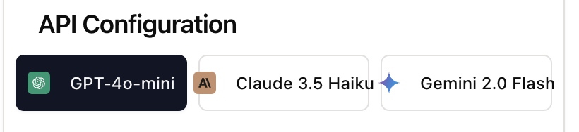

# makejson.online

Convert various document formats into structured JSON using AI. This application leverages state-of-the-art AI models to analyze and transform documents into well-structured JSON format, making it easier to work with unstructured data.



## Features

- **Multiple AI Model Support**
  - OpenAI GPT-4o-mini
  - Anthropic Claude 3.5 Haiku
  - Google Gemini 2.0 Flash

- **Wide File Format Support**
  - Documents: PDF, DOCX, TXT, CSV, XLSX
  - Code Files: JS/TS, HTML, CSS, PHP, SQL, Python, JSON, XML, MD
  - Archives: ZIP (processes all compatible files within)

- **Advanced Processing**
  - Intelligent content extraction
  - Maintains document structure
  - Handles large files through chunking
  - Batch processing support

- **Security & Privacy**
  - Client-side API key storage
  - No server-side data retention
  - Secure file processing

## Getting Started

### Prerequisites

- Node.js 18+ or Node.js 20+
- npm or yarn
- API key from one of the supported AI providers:
  - OpenAI
  - Anthropic
  - Google (for Gemini)

### Installation

1. Clone the repository
```bash
git clone https://github.com/yourusername/makejson.online.git
cd makejson.online
```

2. Install dependencies
```bash
npm install
```

3. Start the development server
```bash
npm run dev
```

The application will be available at `http://localhost:5000`.

## Usage

1. **Configure API Key**
   - Select your preferred AI model (OpenAI, Anthropic, or Gemini)
   - Enter your API key for the selected service
   - The key is stored securely in your browser's session storage

2. **Upload Files**
   - Drag and drop files into the upload area
   - Multiple files can be uploaded simultaneously
   - ZIP files will be automatically extracted and processed

3. **Process Files**
   - Click the "Process" button for each file
   - Monitor progress in the Processing Status section
   - View the structured JSON output in the preview panel

4. **View Results**
   - JSON preview with syntax highlighting
   - Copy or download the processed JSON
   - View individual file results from batch processing

## Development

### Tech Stack

- **Frontend**
  - React 18
  - TypeScript
  - Tailwind CSS
  - shadcn/ui components
  - React Query for data fetching

- **Backend**
  - Express.js
  - Multer for file handling
  - Multiple AI service integrations

### Project Structure

```
├── client/                 # Frontend React application
│   ├── src/
│   │   ├── components/    # React components
│   │   ├── hooks/        # Custom React hooks
│   │   ├── lib/          # Utility functions
│   │   └── pages/        # Page components
├── server/                # Backend Express application
│   ├── lib/              # Backend utilities
│   └── routes.ts         # API routes
└── public/               # Static assets
```

## Security & Privacy

- API keys are stored only in the browser's session storage
- Files are processed in memory and not stored on the server
- No data is retained after processing
- All processing happens in real-time

## Contributing

Contributions are welcome! Please read our [Contributing Guidelines](CONTRIBUTING.md) for details on our code of conduct and the process for submitting pull requests.

## License

This project is licensed under the MIT License - see the [LICENSE](LICENSE) file for details.

## Support

Like makejson.online? [Buy me a coffee](https://www.buymeacoffee.com/georgipep) ☕

Created by [Georgi](https://x.com/georgipep)
