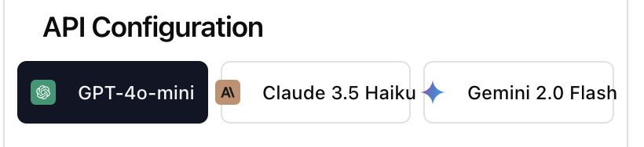

# makejson.online

Convert documents into structured JSON using the AI provider of your choice.

**It runs entirely in your browser.** There is no backend: your files are parsed
locally in the tab, and the extracted text goes straight from your browser to the
AI provider using your own API key. Nothing is uploaded to makejson.online, because
makejson.online has nowhere to upload it to.



## Features

- **Bring your own key** — OpenAI, Anthropic, Google Gemini, or OpenRouter
  - OpenAI `gpt-4o-mini`
  - Anthropic `claude-3-5-haiku-latest`
  - Google `gemini-2.0-flash`
  - OpenRouter (pick a model, e.g. `openai/gpt-4o-mini` or `anthropic/claude-sonnet-4`)
- **Wide file format support**
  - Documents: PDF, DOCX, TXT, CSV, XLSX
  - Code: JS/TS, HTML, CSS, PHP, SQL, Python, JSON, XML, MD
  - Archives: ZIP (every readable file inside is processed)
- **Local processing**
  - PDF text via `pdf.js`, DOCX via `mammoth`, spreadsheets via `SheetJS`, archives via `JSZip`
  - Large documents are chunked before being sent to the model
  - macOS/editor cruft (`__MACOSX`, `.DS_Store`) is filtered out of archives

## Privacy

- Your API key lives in `sessionStorage` and is cleared when you close the tab.
- File contents never touch a server owned by this project.
- The only outbound request is the one your browser makes to your chosen AI provider.

That said: the extracted text *is* sent to that provider under your own account,
so their terms and data policies apply. Don't feed it anything you wouldn't paste
into their console yourself.

## Running locally

```bash
npm install
npm run dev      # http://localhost:5173
```

Build a production bundle:

```bash
npm run build    # static files land in dist/
npm run preview
```

`dist/` is a plain static site — host it anywhere that serves files.

## Deploying

The build uses a relative base path and hash-based routing, so the same `dist/`
works whether it is served from a domain root or a subdirectory, with no server
rewrite rules required.

## Tech stack

React 18, TypeScript, Vite, Tailwind CSS, shadcn/ui, wouter.

Version 2 removed the Express server, the Postgres/Drizzle setup and the SMTP
contact form that the original Replit build depended on. None of them were needed
for the tool to do its job, and all of them were things that could break. Design
tokens that used to be generated from `theme.json` by a Replit-only Vite plugin are
now checked into `client/src/index.css`.

## Contributing

Issues and pull requests welcome at
[github.com/kr3t3n/makejson](https://github.com/kr3t3n/makejson).

## License

MIT — see [LICENSE](LICENSE).

## Support

Like makejson.online? [Buy me a coffee](https://buymeacoffee.com/georgipep) ☕

Created by [Georgi](https://x.com/georgipep) · part of [aithings.online](https://aithings.online)
